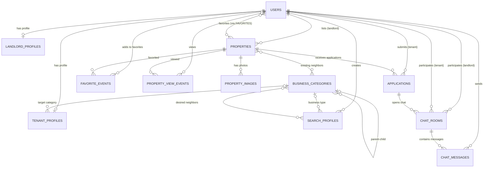

# Модель хранения данных — нотация Мартина (crow's foot)

**СУБД:** PostgreSQL 15  
**ORM:** Hibernate 6 (JPA), DDL-стратегия: `update`  
**Схема:** public (по умолчанию)

---

## 1. Перечисления (Enum-типы)

Все enum хранятся в столбцах `VARCHAR` как строковые значения (`@Enumerated(EnumType.STRING)`).

| Enum | Значения | Смысл |
|------|----------|-------|
| **Role** | `TENANT`, `LANDLORD`, `ADMIN` | Роль пользователя в системе |
| **UserStatus** | `UNVERIFIED`, `ACTIVE`, `BANNED` | Статус учётной записи |
| **PropertyStatus** | `DRAFT`, `PUBLISHED`, `RENTED`, `ARCHIVED` | Жизненный цикл объекта недвижимости |
| **PropertyType** | `OFFICE`, `RETAIL`, `WAREHOUSE`, `PRODUCTION`, `PSN`, `CATERING` | Назначение помещения |
| **DealType** | `DIRECT_LEASE`, `SUBLEASE` | Тип сделки (прямая аренда / субаренда) |
| **BuildingClass** | `A`, `B`, `B_PLUS`, `C`, `D` | Класс здания |
| **RepairState** | `SHELL_AND_CORE`, `TYPICAL`, `DESIGNER`, `PRE_FINISHING` | Состояние ремонта |
| **LayoutType** | `OPEN_SPACE`, `CABINET`, `MIXED` | Тип планировки |
| **AccessType** | `FREE`, `SCHEDULE`, `PASS` | Режим доступа в помещение |
| **HeatingType** | `CENTRAL`, `AUTONOMOUS`, `NONE` | Тип отопления |
| **FurnitureState** | `EMPTY`, `FURNISHED`, `READY_BUSINESS` | Состояние меблировки |
| **ApplicationStatus** | `PENDING`, `REVIEWING`, `ACCEPTED`, `REJECTED` | Статус заявки на аренду |

---

## 2. Сущности (таблицы)

### 2.1. **USERS** (Пользователи)

Центральная сущность аутентификации. Реализует `UserDetails` Spring Security.

| Столбец | Тип | Ограничения | Описание |
|---------|-----|-------------|----------|
| **id** | BIGSERIAL | PK, auto-increment | Уникальный идентификатор |
| email | VARCHAR | NOT NULL, UNIQUE | Адрес электронной почты (логин) |
| password_hash | VARCHAR | NOT NULL | Хеш пароля (BCrypt) |
| role | VARCHAR | NOT NULL | Роль: `Role` |
| status | VARCHAR | | Статус: `UserStatus` |
| avatar_url | VARCHAR | | URL аватара |
| verification_code | VARCHAR | | Код верификации email |
| code_expires_at | TIMESTAMP | | Срок действия кода |
| created_at | TIMESTAMP | NOT NULL, auto | Дата регистрации |

---

### 2.2. **LANDLORD_PROFILES** (Профили арендодателей)

Расширенный профиль для пользователей с ролью `LANDLORD`. Связь «идентифицирующая» — PK совпадает с FK.

| Столбец | Тип | Ограничения | Описание |
|---------|-----|-------------|----------|
| **user_id** | BIGINT | PK, FK → users.id | Идентификатор = идентификатор пользователя |
| company_name | VARCHAR | | Название компании |
| inn | VARCHAR | | ИНН организации |
| phone | VARCHAR | | Контактный телефон |
| is_verified | BOOLEAN | | Подтверждён ли профиль |

---

### 2.3. **TENANT_PROFILES** (Профили арендаторов)

Расширенный профиль для пользователей с ролью `TENANT`.

| Столбец | Тип | Ограничения | Описание |
|---------|-----|-------------|----------|
| **user_id** | BIGINT | PK, FK → users.id | Идентификатор = идентификатор пользователя |
| name | VARCHAR | | Имя / наименование арендатора |
| inn | VARCHAR | UNIQUE | ИНН |
| phone | VARCHAR | | Контактный телефон |
| target_business_category_id | BIGINT | FK → business_categories.id | Целевая бизнес-категория |

---

### 2.4. **BUSINESS_CATEGORIES** (Бизнес-категории)

Иерархический справочник категорий бизнеса (рекурсивная связь). Используется для скоринга конкурентов/синергии.

| Столбец | Тип | Ограничения | Описание |
|---------|-----|-------------|----------|
| **id** | BIGSERIAL | PK | Уникальный идентификатор |
| name | VARCHAR | NOT NULL | Название категории (напр. «Кофейня», «Аптека») |
| parent_id | BIGINT | FK → business_categories.id, NULL | Ссылка на родительскую категорию |
| search_keywords | TEXT | | OSM-теги для Overpass API (CSV-формат) |

---

### 2.5. **PROPERTIES** (Объекты недвижимости)

Основная бизнес-сущность — коммерческое помещение, выставленное арендодателем.

| Столбец | Тип | Ограничения | Описание |
|---------|-----|-------------|----------|
| **id** | BIGSERIAL | PK | Уникальный идентификатор |
| landlord_id | BIGINT | FK → users.id, NOT NULL | Владелец объявления |
| title | VARCHAR | NOT NULL | Заголовок объявления |
| description | TEXT | | Подробное описание |
| address | VARCHAR | | Адрес |
| latitude | DECIMAL(10,8) | | Широта |
| longitude | DECIMAL(11,8) | | Долгота |
| area_sqm | DECIMAL(10,2) | | Площадь, м² |
| price_per_month | DECIMAL(12,2) | | Арендная ставка / мес. |
| status | VARCHAR | | `PropertyStatus` |
| property_type | VARCHAR | | `PropertyType` |
| deal_type | VARCHAR | | `DealType` |
| building_name | VARCHAR | | Название здания |
| building_class | VARCHAR | | `BuildingClass` |
| floor | INTEGER | | Этаж |
| total_floors | INTEGER | | Всего этажей |
| build_year | INTEGER | | Год постройки |
| tax_included | BOOLEAN | | НДС включён |
| opex_included | BOOLEAN | | OPEX включён |
| utility_included | BOOLEAN | | КУ включены |
| deposit_months | INTEGER | | Кол-во месяцев залога |
| rent_holidays | BOOLEAN | | Арендные каникулы |
| legal_address_provided | BOOLEAN | | Юридический адрес |
| metro_station | VARCHAR | | Ближайшее метро |
| time_to_metro | INTEGER | | Время до метро (мин.) |
| power_kw | INTEGER | | Электрическая мощность, кВт |
| has_water | BOOLEAN | | Водоснабжение |
| has_ventilation | BOOLEAN | | Вентиляция |
| has_separate_entrance | BOOLEAN | | Отдельный вход |
| repair_state | VARCHAR | | `RepairState` |
| ceiling_height | DECIMAL(4,2) | | Высота потолков, м |
| layout | VARCHAR | | `LayoutType` |
| parking | VARCHAR | | Описание парковки |
| security | VARCHAR | | Охрана |
| has_wc | BOOLEAN | | Санузел |
| has_parking | BOOLEAN | | Есть парковка |
| has_loading_zone | BOOLEAN | | Зона разгрузки |
| contact_name | VARCHAR | | Контактное лицо |
| contact_phone | VARCHAR | | Телефон контакта |
| agent_fee | DECIMAL(5,2) | | Комиссия агента, % |
| cadastral_number | VARCHAR | | Кадастровый номер |
| access_type | VARCHAR | | `AccessType` |
| heating_type | VARCHAR | | `HeatingType` |
| furniture_state | VARCHAR | | `FurnitureState` |
| is_occupied | BOOLEAN | | Сдаётся / пустует |

---

### 2.6. **PROPERTY_IMAGES** (Изображения объектов)

Фотографии, привязанные к объекту недвижимости.

| Столбец | Тип | Ограничения | Описание |
|---------|-----|-------------|----------|
| **id** | BIGSERIAL | PK | Уникальный идентификатор |
| property_id | BIGINT | FK → properties.id, NOT NULL | К какому объекту относится |
| image_url | VARCHAR | NOT NULL | URL изображения |
| is_main | BOOLEAN | | Главное фото объявления |

---

### 2.7. **SEARCH_PROFILES** (Проекты поиска)

Сохранённые критерии поиска арендатора. Используются для скоринга объектов.

| Столбец | Тип | Ограничения | Описание |
|---------|-----|-------------|----------|
| **id** | BIGSERIAL | PK | Уникальный идентификатор |
| tenant_id | BIGINT | FK → users.id, NOT NULL | Кому принадлежит профиль |
| name | VARCHAR | NOT NULL | Название проекта (напр. «Кофейня на Арбате») |
| business_category_id | BIGINT | FK → business_categories.id | Тип открываемого бизнеса |
| min_area | DECIMAL(10,2) | | Мин. площадь |
| max_area | DECIMAL(10,2) | | Макс. площадь |
| min_budget | DECIMAL(12,2) | | Мин. бюджет |
| max_budget | DECIMAL(12,2) | | Макс. бюджет |
| min_power_kw | INTEGER | | Мин. мощность |
| requires_water | BOOLEAN | | Нужна вода |
| requires_ventilation | BOOLEAN | | Нужна вентиляция |
| requires_separate_entrance | BOOLEAN | | Нужен отдельный вход |
| requires_wc | BOOLEAN | | Нужен санузел |
| requires_parking | BOOLEAN | | Нужна парковка |
| requires_loading_zone | BOOLEAN | | Нужна зона разгрузки |
| min_ceiling_height | DECIMAL(4,2) | | Мин. высота потолков |
| center_latitude | DECIMAL(10,8) | | Центр поиска — широта |
| center_longitude | DECIMAL(11,8) | | Центр поиска — долгота |
| search_radius_meters | INTEGER | | Радиус поиска конкурентов, м |
| synergy_radius_meters | INTEGER | | Радиус поиска соседей-синергистов, м |
| is_active | BOOLEAN | | Активен ли проект |
| created_at | TIMESTAMP | NOT NULL, auto | Дата создания |

---

### 2.8. **APPLICATIONS** (Заявки на аренду)

Заявка арендатора на конкретный объект.

| Столбец | Тип | Ограничения | Описание |
|---------|-----|-------------|----------|
| **id** | BIGSERIAL | PK | Уникальный идентификатор |
| property_id | BIGINT | FK → properties.id, NOT NULL | Объект, на который подана заявка |
| tenant_id | BIGINT | FK → users.id, NOT NULL | Арендатор, подавший заявку |
| status | VARCHAR | NOT NULL | `ApplicationStatus` |
| cover_letter | TEXT | | Сопроводительное письмо |
| rejection_reason | TEXT | | Причина отказа (если REJECTED) |
| created_at | TIMESTAMP | NOT NULL, auto | Дата подачи |

---

### 2.9. **CHAT_ROOMS** (Комнаты чата)

Чат-комната, создаваемая на базе заявки для общения арендодателя и арендатора.

| Столбец | Тип | Ограничения | Описание |
|---------|-----|-------------|----------|
| **id** | BIGSERIAL | PK | Уникальный идентификатор |
| application_id | BIGINT | FK → applications.id, NOT NULL | Связанная заявка |
| landlord_id | BIGINT | FK → users.id, NOT NULL | Арендодатель |
| tenant_id | BIGINT | FK → users.id, NOT NULL | Арендатор |
| created_at | TIMESTAMP | NOT NULL, auto | Дата создания |

---

### 2.10. **CHAT_MESSAGES** (Сообщения чата)

Отдельное сообщение внутри чат-комнаты.

| Столбец | Тип | Ограничения | Описание |
|---------|-----|-------------|----------|
| **id** | BIGSERIAL | PK | Уникальный идентификатор |
| chat_room_id | BIGINT | FK → chat_rooms.id, NOT NULL | Комната-владелец |
| sender_id | BIGINT | FK → users.id, NOT NULL | Автор сообщения |
| content | TEXT | NOT NULL | Текст сообщения |
| is_read | BOOLEAN | | Прочитано ли получателем |
| timestamp | TIMESTAMP | NOT NULL, auto | Время отправки |

---

### 2.11. **FAVORITE_EVENTS** (События добавления в избранное)

Лог-таблица: фиксирует каждый факт добавления объекта в избранное (аналитика).

| Столбец | Тип | Ограничения | Описание |
|---------|-----|-------------|----------|
| **id** | BIGSERIAL | PK | Уникальный идентификатор |
| property_id | BIGINT | FK → properties.id, NOT NULL | Объект |
| tenant_id | BIGINT | FK → users.id | Кто добавил |
| created_at | TIMESTAMP | NOT NULL, auto | Время события |

---

### 2.12. **PROPERTY_VIEW_EVENTS** (События просмотра объектов)

Лог-таблица: фиксирует каждый просмотр карточки объекта (аналитика).

| Столбец | Тип | Ограничения | Описание |
|---------|-----|-------------|----------|
| **id** | BIGSERIAL | PK | Уникальный идентификатор |
| property_id | BIGINT | FK → properties.id, NOT NULL | Просмотренный объект |
| viewer_id | BIGINT | FK → users.id, NULL | Кто просмотрел (NULL = аноним) |
| view_timestamp | TIMESTAMP | NOT NULL, auto | Время просмотра |

---

### 2.13. **PROPERTY_SCORE_SNAPSHOTS** (Снимки оценок объектов)

Кэш результатов скоринга помещения для конкретного проекта поиска.

| Столбец | Тип | Ограничения | Описание |
|---------|-----|-------------|----------|
| **id** | BIGSERIAL | PK | Уникальный идентификатор |
| property_id | BIGINT | NOT NULL | Оценённый объект |
| profile_id | BIGINT | | Профиль поиска |
| algorithm_version | VARCHAR(16) | NOT NULL | Версия алгоритма скоринга |
| total_score | INTEGER | NOT NULL | Общий балл |
| financial_score | INTEGER | NOT NULL | Финансовый балл |
| technical_score | INTEGER | NOT NULL | Технический балл |
| competitor_score | INTEGER | NOT NULL | Конкурентный балл |
| synergy_score | INTEGER | NOT NULL | Балл синергии |
| transport_score | INTEGER | NOT NULL | Транспортный балл |
| match_label | VARCHAR(128) | | Текстовая метка совпадения |
| match_color | VARCHAR(16) | | Цвет метки (для UI) |
| data_status | VARCHAR(32) | NOT NULL | Статус данных (FRESH / STALE / ...) |
| payload_json | TEXT | NOT NULL | JSON с детальной разбивкой |
| computed_at | TIMESTAMP | NOT NULL | Время вычисления |

> **Уникальное ограничение:** `(property_id, profile_id, algorithm_version)` — одна оценка на версию алгоритма.

> [!NOTE]
> `property_id` и `profile_id` хранятся как простые BIGINT, без JPA-связей `@ManyToOne`. Это осознанное решение для оптимизации производительности пакетных операций скоринга.

---

### 2.14. **OVERPASS_CACHE** (Кэш Overpass API)

Долгоживущий кэш ответов Overpass API (OSM). Дополняет in-memory Caffeine-кэш.

| Столбец | Тип | Ограничения | Описание |
|---------|-----|-------------|----------|
| **id** | BIGSERIAL | PK | Уникальный идентификатор |
| cache_key | VARCHAR(64) | NOT NULL, UNIQUE | Ключ кэша (координаты+радиус) |
| response_json | TEXT | NOT NULL | Сериализованный JSON-ответ |
| cached_at | TIMESTAMP | NOT NULL | Время помещения в кэш |

---

## 3. Связующие таблицы (Join Tables)

Эти таблицы **не имеют собственной JPA-сущности**, а генерируются автоматически через `@JoinTable`.

### 3.1. **FAVORITES** (Избранные объекты пользователя)

Связь M:N между `users` и `properties`.

| Столбец | Тип | Ограничения | Описание |
|---------|-----|-------------|----------|
| tenant_id | BIGINT | FK → users.id, NOT NULL | Арендатор |
| property_id | BIGINT | FK → properties.id, NOT NULL | Объект в избранном |

> Составной PK: `(tenant_id, property_id)`

---

### 3.2. **PROPERTY_EXISTING_NEIGHBORS** (Существующие соседи объекта)

Связь M:N между `properties` и `business_categories`. Показывает, какие бизнес-категории уже присутствуют рядом с объектом.

| Столбец | Тип | Ограничения | Описание |
|---------|-----|-------------|----------|
| property_id | BIGINT | FK → properties.id, NOT NULL | Объект |
| category_id | BIGINT | FK → business_categories.id, NOT NULL | Категория-сосед |

> Составной PK: `(property_id, category_id)`

---

### 3.3. **SEARCH_PROFILE_DESIRED_NEIGHBORS** (Желаемые соседи профиля поиска)

Связь M:N между `search_profiles` и `business_categories`. Какие категории бизнеса арендатор хочет видеть рядом (синергия).

| Столбец | Тип | Ограничения | Описание |
|---------|-----|-------------|----------|
| search_profile_id | BIGINT | FK → search_profiles.id, NOT NULL | Профиль поиска |
| category_id | BIGINT | FK → business_categories.id, NOT NULL | Желаемая категория-сосед |

> Составной PK: `(search_profile_id, category_id)`

---

## 4. Связи между сущностями (нотация Мартина — crow's foot)

В нотации Мартина используются следующие символы на концах линий:
- **`||`** (одна вертикальная черта) — ровно один (обязательный)
- **`|O`** (вертикальная черта + кружок) — ноль или один (необязательный)
- **`>|`** (вороньи лапки + черта) — один или более (обязательный)
- **`>O`** (вороньи лапки + кружок) — ноль или более (необязательный)

### 4.1. Идентифицирующие связи (1:1)

```
USERS ||——————————|O LANDLORD_PROFILES
```
- **Кратность:** 1 : 0..1
- **Смысл:** Каждый пользователь **может** иметь не более одного профиля арендодателя. Профиль арендодателя **обязательно** принадлежит ровно одному пользователю. PK `landlord_profiles.user_id` является одновременно FK на `users.id` (`@MapsId`).

```
USERS ||——————————|O TENANT_PROFILES
```
- **Кратность:** 1 : 0..1
- **Смысл:** Каждый пользователь **может** иметь не более одного профиля арендатора. Профиль арендатора **обязательно** принадлежит ровно одному пользователю. PK `tenant_profiles.user_id` является одновременно FK на `users.id` (`@MapsId`).

---

### 4.2. Связи «Один ко многим» (1:N)

```
USERS ||————————O< PROPERTIES
```
- **Кратность:** 1 : 0..*
- **FK:** `properties.landlord_id → users.id` (NOT NULL)
- **Смысл:** Один пользователь (арендодатель) **размещает** ноль или более объектов. Каждый объект **принадлежит** ровно одному арендодателю.

---

```
PROPERTIES ||————————O< PROPERTY_IMAGES
```
- **Кратность:** 1 : 0..*
- **FK:** `property_images.property_id → properties.id` (NOT NULL, cascade ALL + orphanRemoval)
- **Смысл:** Один объект **имеет** ноль или более изображений. Каждое изображение **относится** к ровно одному объекту. При удалении объекта все его фото удаляются каскадно.

---

```
USERS ||————————O< SEARCH_PROFILES
```
- **Кратность:** 1 : 0..*
- **FK:** `search_profiles.tenant_id → users.id` (NOT NULL)
- **Смысл:** Один арендатор **создаёт** ноль или более проектов поиска. Каждый проект **принадлежит** ровно одному арендатору.

---

```
PROPERTIES ||————————O< APPLICATIONS
```
- **Кратность:** 1 : 0..*
- **FK:** `applications.property_id → properties.id` (NOT NULL)
- **Смысл:** На один объект может быть подано **ноль или более** заявок. Каждая заявка **относится** к ровно одному объекту.

---

```
USERS ||————————O< APPLICATIONS
```
- **Кратность:** 1 : 0..*
- **FK:** `applications.tenant_id → users.id` (NOT NULL)
- **Смысл:** Один арендатор **подаёт** ноль или более заявок. Каждая заявка **принадлежит** ровно одному арендатору.

---

```
APPLICATIONS ||————————O< CHAT_ROOMS
```
- **Кратность:** 1 : 0..*
- **FK:** `chat_rooms.application_id → applications.id` (NOT NULL)
- **Смысл:** Для одной заявки может быть создана **одна или несколько** чат-комнат. Каждая комната **привязана** к ровно одной заявке.

---

```
USERS ||————————O< CHAT_ROOMS (как landlord)
```
- **Кратность:** 1 : 0..*
- **FK:** `chat_rooms.landlord_id → users.id` (NOT NULL)
- **Смысл:** Один арендодатель **участвует** в нуле или более чатах.

---

```
USERS ||————————O< CHAT_ROOMS (как tenant)
```
- **Кратность:** 1 : 0..*
- **FK:** `chat_rooms.tenant_id → users.id` (NOT NULL)
- **Смысл:** Один арендатор **участвует** в нуле или более чатах.

---

```
CHAT_ROOMS ||————————O< CHAT_MESSAGES
```
- **Кратность:** 1 : 0..*
- **FK:** `chat_messages.chat_room_id → chat_rooms.id` (NOT NULL)
- **Смысл:** В одной комнате **ноль или более** сообщений. Каждое сообщение **принадлежит** ровно одной комнате.

---

```
USERS ||————————O< CHAT_MESSAGES (как sender)
```
- **Кратность:** 1 : 0..*
- **FK:** `chat_messages.sender_id → users.id` (NOT NULL)
- **Смысл:** Один пользователь **отправляет** ноль или более сообщений.

---

```
PROPERTIES ||————————O< FAVORITE_EVENTS
```
- **Кратность:** 1 : 0..*
- **FK:** `favorite_events.property_id → properties.id` (NOT NULL)
- **Смысл:** По одному объекту **ноль или более** событий «добавление в избранное».

---

```
USERS |O————————O< FAVORITE_EVENTS
```
- **Кратность:** 0..1 : 0..*
- **FK:** `favorite_events.tenant_id → users.id` (NULL допустим)
- **Смысл:** Один арендатор **генерирует** ноль или более событий. Может быть анонимным (NULL).

---

```
PROPERTIES ||————————O< PROPERTY_VIEW_EVENTS
```
- **Кратность:** 1 : 0..*
- **FK:** `property_view_events.property_id → properties.id` (NOT NULL)
- **Смысл:** По одному объекту **ноль или более** просмотров.

---

```
USERS |O————————O< PROPERTY_VIEW_EVENTS
```
- **Кратность:** 0..1 : 0..*
- **FK:** `property_view_events.viewer_id → users.id` (NULL допустим)
- **Смысл:** Один пользователь **просматривает** ноль или более объектов. Аноним = NULL.

---

### 4.3. Рекурсивная связь (самоссылка)

```
BUSINESS_CATEGORIES |O————————O< BUSINESS_CATEGORIES
```
- **Кратность:** 0..1 : 0..*
- **FK:** `business_categories.parent_id → business_categories.id` (NULL допустим)
- **Смысл:** Одна категория **может содержать** ноль или более подкатегорий. Каждая категория **может принадлежать** одной родительской категории (или быть корневой, если parent_id = NULL).

---

### 4.4. Связи «Многие к одному» (N:1, справочные)

```
TENANT_PROFILES O>————————|O BUSINESS_CATEGORIES
```
- **Кратность:** 0..* : 0..1
- **FK:** `tenant_profiles.target_business_category_id → business_categories.id` (NULL допустим)
- **Смысл:** Профиль арендатора **может ссылаться** на одну целевую бизнес-категорию. Одна категория **может быть целевой** для многих арендаторов.

---

```
SEARCH_PROFILES O>————————|O BUSINESS_CATEGORIES
```
- **Кратность:** 0..* : 0..1
- **FK:** `search_profiles.business_category_id → business_categories.id` (NULL допустим)
- **Смысл:** Проект поиска **может быть связан** с одной бизнес-категорией (тип открываемого бизнеса).

---

### 4.5. Связи «Многие ко многим» (M:N)

```
USERS O<————————>O PROPERTIES
      через таблицу FAVORITES
```
- **Кратность:** 0..* : 0..*
- **Join Table:** `favorites(tenant_id, property_id)`
- **Смысл:** Арендатор **добавляет** объекты в избранное. Один объект **может быть** в избранном у многих арендаторов. Один арендатор **может** иметь много избранных объектов.

---

```
PROPERTIES O<————————>O BUSINESS_CATEGORIES
           через таблицу PROPERTY_EXISTING_NEIGHBORS
```
- **Кратность:** 0..* : 0..*
- **Join Table:** `property_existing_neighbors(property_id, category_id)`
- **Смысл:** Объект **имеет** определённый набор существующих бизнес-соседей (категорий). Одна категория **может быть соседом** множества объектов.

---

```
SEARCH_PROFILES O<————————>O BUSINESS_CATEGORIES
                через таблицу SEARCH_PROFILE_DESIRED_NEIGHBORS
```
- **Кратность:** 0..* : 0..*
- **Join Table:** `search_profile_desired_neighbors(search_profile_id, category_id)`
- **Смысл:** Профиль поиска **определяет** набор желаемых бизнес-категорий-соседей (синергия). Одна категория **может быть желаемой** для многих профилей.

---

### 4.6. Логические (не JPA) связи

```
PROPERTY_SCORE_SNAPSHOTS ···> PROPERTIES (по property_id)
PROPERTY_SCORE_SNAPSHOTS ···> SEARCH_PROFILES (по profile_id)
```
- **Кратность:** 0..* : 1 (для property_id), 0..* : 0..1 (для profile_id)
- **Смысл:** Снимок оценки **ссылается** на объект и профиль поиска через простые BIGINT, без JPA-ассоциаций. Решение обусловлено производительностью пакетных upsert-операций скоринга.

---

## 5. Сводная диаграмма связей (текстовая)

Ниже — текстовое представление для отрисовки ER-диаграммы. Каждая линия — одна связь. Формат: `СУЩНОСТЬ_A [кратность_A] ——— [кратность_B] СУЩНОСТЬ_B : глагол`.

```
USERS            ||——|O  LANDLORD_PROFILES        : имеет профиль
USERS            ||——|O  TENANT_PROFILES           : имеет профиль
USERS            ||——O<  PROPERTIES                : размещает
USERS            ||——O<  APPLICATIONS              : подаёт (tenant)
USERS            ||——O<  SEARCH_PROFILES           : создаёт
USERS            ||——O<  CHAT_ROOMS                : участвует (landlord)
USERS            ||——O<  CHAT_ROOMS                : участвует (tenant)
USERS            ||——O<  CHAT_MESSAGES             : отправляет
USERS            |O——O<  FAVORITE_EVENTS           : добавляет в избранное
USERS            |O——O<  PROPERTY_VIEW_EVENTS      : просматривает

PROPERTIES       ||——O<  PROPERTY_IMAGES           : содержит фото
PROPERTIES       ||——O<  APPLICATIONS              : принимает заявки
PROPERTIES       ||——O<  FAVORITE_EVENTS           : добавляется в избранное
PROPERTIES       ||——O<  PROPERTY_VIEW_EVENTS      : просматривается

APPLICATIONS     ||——O<  CHAT_ROOMS                : порождает чат

CHAT_ROOMS       ||——O<  CHAT_MESSAGES             : содержит сообщения

BUSINESS_CATEGORIES |O——O<  BUSINESS_CATEGORIES    : содержит подкатегории
BUSINESS_CATEGORIES |O——O>  TENANT_PROFILES        : целевая категория
BUSINESS_CATEGORIES |O——O>  SEARCH_PROFILES        : тип бизнеса

USERS            O<——>O  PROPERTIES                : избранное (через FAVORITES)
PROPERTIES       O<——>O  BUSINESS_CATEGORIES       : существующие соседи (через PROPERTY_EXISTING_NEIGHBORS)
SEARCH_PROFILES  O<——>O  BUSINESS_CATEGORIES       : желаемые соседи (через SEARCH_PROFILE_DESIRED_NEIGHBORS)

PROPERTY_SCORE_SNAPSHOTS ···> PROPERTIES            : оценка объекта
PROPERTY_SCORE_SNAPSHOTS ···> SEARCH_PROFILES       : в контексте профиля
```

---

## 6. Mermaid-диаграмма для визуализации



---

## 7. Изолированные сущности

Таблица **OVERPASS_CACHE** не имеет связей с другими сущностями. Это самостоятельная техническая таблица кэширования, индексируемая по `cache_key`.

Таблица **PROPERTY_SCORE_SNAPSHOTS** формально тоже изолирована на уровне JPA (нет `@ManyToOne`), но логически ссылается на `PROPERTIES.id` и `SEARCH_PROFILES.id`.
