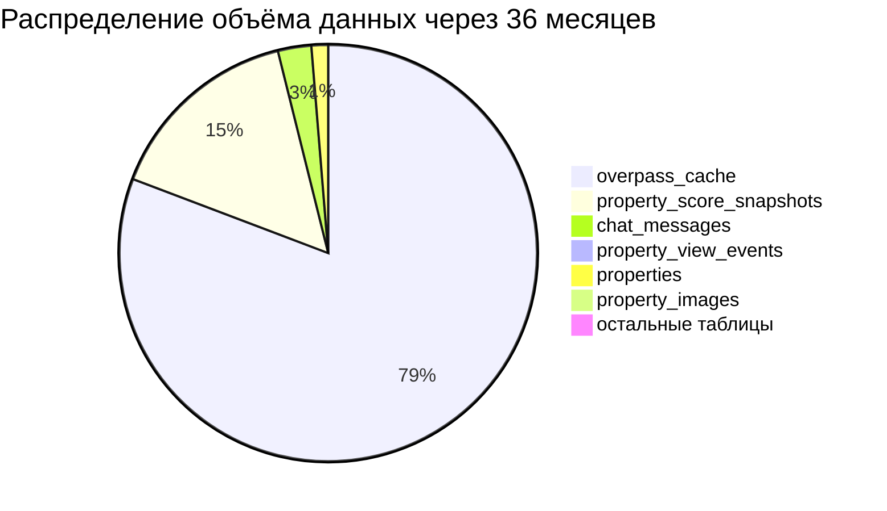
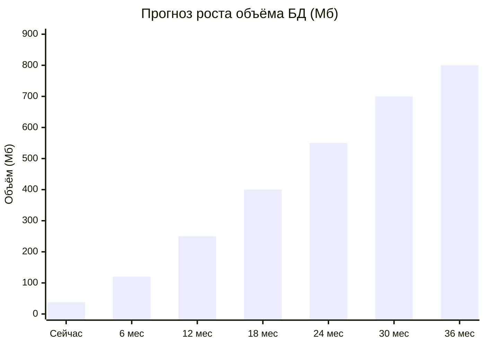

# 12. Метрики базы данных и прогноз роста

Документ содержит текущие метрики базы данных PostgreSQL 15 системы **Street Retail Aggregator**, сводные показатели и прогноз нагрузки на 3 года непрерывной эксплуатации.

> [!NOTE]
> Дата замера: **31 мая 2026 г.** Система находится на этапе MVP/раннего запуска.
> СУБД: PostgreSQL 15 (Alpine), режим DDL: `hibernate.ddl-auto=update`.
> Хост: Windows, Docker Desktop, single-host деплой.

---

## 1. Текущие метрики базы данных в «сыром виде»

### 1.1. Перечень таблиц и количество записей

Система содержит **14 entity-таблиц** и **3 join-таблицы** (без отдельной JPA-сущности).

#### Основные entity-таблицы

| № | Таблица | Сущность (JPA) | Кол-во записей | Средний размер строки (байт) | Объём данных (Кб) | Объём индексов (Кб) | Итого (Кб) |
|---|---------|----------------|:--------------:|:----------------------------:|:-----------------:|:-------------------:|:----------:|
| 1 | `users` | `User` | 2 | ~320 | 8 | 32 | 48 |
| 2 | `tenant_profiles` | `TenantProfile` | 1 | ~160 | 8 | 32 | 48 |
| 3 | `landlord_profiles` | `LandlordProfile` | 1 | ~140 | 8 | 16 | 32 |
| 4 | `properties` | `Property` | 21 | ~1 400 | 24 | 16 | 72 |
| 5 | `property_images` | `PropertyImage` | 50 | ~180 | 16 | 16 | 56 |
| 6 | `business_categories` | `BusinessCategory` | 35 | ~250 | 8 | 16 | 32 |
| 7 | `search_profiles` | `SearchProfile` | 4 | ~420 | 8 | 16 | 24 |
| 8 | `applications` | `Application` | 1 | ~300 | 8 | 16 | 32 |
| 9 | `chat_rooms` | `ChatRoom` | 1 | ~80 | 8 | 16 | 24 |
| 10 | `chat_messages` | `ChatMessage` | 2 | ~250 | 8 | 16 | 32 |
| 11 | `property_view_events` | `PropertyViewEvent` | 57 | ~40 | 8 | 16 | 24 |
| 12 | `favorite_events` | `FavoriteEvent` | 2 | ~40 | 8 | 16 | 24 |
| 13 | `overpass_cache` | `OverpassCacheEntry` | 20 | ~135 000 | 8 (2 704 TOAST) | 32 | 2 744 |
| 14 | `property_score_snapshots` | `PropertyScoreSnapshot` | 84 | ~6 500 | 96 (544 TOAST) | 48 | 688 |

#### Join-таблицы (без JPA-сущности)

| № | Таблица | Связь | Кол-во записей | Объём данных (Кб) | Итого с индексами (Кб) |
|---|---------|-------|:--------------:|:-----------------:|:----------------------:|
| 15 | `favorites` | User ↔ Property (N:M) | 2 | 8 | 24 |
| 16 | `property_existing_neighbors` | Property ↔ BusinessCategory (N:M) | 0 | 0 | 8 |
| 17 | `search_profile_desired_neighbors` | SearchProfile ↔ BusinessCategory (N:M) | 2 | 8 | 24 |

### 1.2. Описание колонок ключевых таблиц

| Таблица | Кол-во колонок | TEXT-поля (тяжёлые) | Индексы | Unique constraints |
|---------|:--------------:|:-------------------:|:-------:|:------------------:|
| `users` | 9 | — | PK, `email` UNIQUE | `email` |
| `tenant_profiles` | 5 | — | PK (shared с `users`) | `inn` |
| `landlord_profiles` | 5 | — | PK (shared с `users`) | — |
| `properties` | 37+ | `description` (TEXT) | PK, FK `landlord_id` | — |
| `property_images` | 4 | — | PK, FK `property_id` | — |
| `business_categories` | 4 | `search_keywords` (TEXT) | PK, FK `parent_id` | — |
| `search_profiles` | 19 | — | PK, FK `tenant_id`, FK `business_category_id` | — |
| `applications` | 6 | `cover_letter`, `rejection_reason` (TEXT) | PK, FK `property_id`, FK `tenant_id` | — |
| `chat_rooms` | 5 | — | PK, FK `application_id`, FK `landlord_id`, FK `tenant_id` | — |
| `chat_messages` | 5 | `content` (TEXT) | PK, FK `chat_room_id`, FK `sender_id` | — |
| `property_view_events` | 4 | — | PK, FK `property_id`, FK `viewer_id` | — |
| `favorite_events` | 4 | — | PK, FK `property_id`, FK `tenant_id` | — |
| `overpass_cache` | 4 | `response_json` (TEXT, ~100–200 Кб JSON) | PK, `idx_overpass_cache_key` (UNIQUE) | `cache_key` |
| `property_score_snapshots` | 13 | `payload_json` (TEXT, ~3–5 Кб JSON) | PK, `idx_score_snapshot_lookup`, UK composite | `(property_id, profile_id, algorithm_version)` |

---

## 2. Сводные метрики БД

### 2.1. Общий объём чистых данных (tuple data)

| Показатель | Значение |
|------------|:--------:|
| Суммарный объём данных (все таблицы, включая TOAST, без индексов) | **~3.48 Мб** |
| Из них `overpass_cache` | ~2.70 Мб (≈78% всех данных) |
| Из них `property_score_snapshots` | ~0.64 Мб (≈18% всех данных) |
| Данные без кэш-таблиц | ~0.14 Мб (≈4% всех данных) |

### 2.2. Общий объём с учётом служебных объектов

| Компонент | Объём |
|-----------|:-----:|
| Чистые данные (tuple data + TOAST) | ~3.48 Мб |
| Индексы (B-tree, UNIQUE, FK) | ~0.34 Мб |
| Системные страницы (pg_catalog) и свободное пространство (FSM, VM, WAL) | ~8.54 Мб |
| **Итого занимаемый объём базы на диске** | **12.36 Мб** |

> [!TIP]
> Основной «тяжёлый» объект — таблица `overpass_cache`, хранящая сериализованные JSON-ответы Overpass API (по ~100–200 Кб на запись). Она же будет основным источником роста базы.

### 2.3. Распределение по типам данных

```
┌─────────────────────────────────────────────────────────┐
│                  Объём данных по таблицам                │
├─────────────────────────────────────────────────────────┤
│ ███████████████████████████████████      overpass_cache │  78%
│ ████████                                 score_snapshots│  18%
│ █                                        properties     │   1%
│ █                                        остальные (14) │   3%
└─────────────────────────────────────────────────────────┘
```

---

## 3. Прогноз на 3 года непрерывной работы (36 месяцев)

### 3.1. Допущения и сценарий роста

Прогноз построен для **консервативного** сценария — нишевый агрегатор коммерческой недвижимости в Москве и ЦФО.

#### Рост пользовательской базы

| Параметр | Месяц 1–6 | Месяц 7–18 | Месяц 19–36 | Итого за 36 мес. |
|----------|:---------:|:----------:|:-----------:|:----------------:|
| Новые арендаторы / мес | 20 | 50 | 100 | **2 520** |
| Новые арендодатели / мес | 5 | 15 | 30 | **630** |
| **Всего пользователей (users)** | | | | **~3 150** |

#### Рост контента и активности

| Параметр | Месяц 1–6 | Месяц 7–18 | Месяц 19–36 | Итого за 36 мес. |
|----------|:---------:|:----------:|:-----------:|:----------------:|
| Новые объявления / мес | 30 | 100 | 200 | **5 580** |
| Фотографий / объявление (среднее) | 3 | 4 | 5 | ×4.3 в среднем |
| Профили поиска / арендатор (среднее) | 1.5 | 2 | 2.5 | ×2 в среднем |
| Заявки / мес | 15 | 80 | 200 | **4 470** |
| Чат-комнат / мес | 10 | 60 | 160 | **3 370** |
| Сообщений / комната (среднее) | 15 | 20 | 25 | ×20 в среднем |
| Просмотров объявлений / мес | 200 | 2 000 | 8 000 | **152 400** |
| Событий «в избранное» / мес | 30 | 300 | 1 200 | **22 980** |

#### Рост кэш-таблиц

| Параметр | Формула/Логика | Итого за 36 мес. |
|----------|----------------|:----------------:|
| `overpass_cache` записей | Уникальных geo-bucket'ов ≈ 1 на ~100 м², радиус Москвы. TTL 7 дней → ротация, но рост покрытия | **~5 000** (устоявшийся объём) |
| `property_score_snapshots` | ≈ properties × active_profiles × 1 (unique constraint). TTL 24ч, cleanup при смене алгоритма | **~25 000** (устоявшийся объём) |

> [!IMPORTANT]
> Кэш-таблицы (`overpass_cache`, `property_score_snapshots`) имеют **механизмы ротации** (TTL 7 дней и 24 часа соответственно), поэтому их рост ограничен количеством уникальных «живых» пар, а не суммарным количеством за всё время.

### 3.2. Прогноз количества записей через 36 месяцев

| № | Таблица | Текущие записи | Прогноз записей (36 мес.) | Коэффициент роста |
|---|---------|:--------------:|:------------------------:|:-----------------:|
| 1 | `users` | 2 | **3 160** | ×1 580 |
| 2 | `tenant_profiles` | 1 | **2 525** | ×2 525 |
| 3 | `landlord_profiles` | 1 | **635** | ×635 |
| 4 | `properties` | 21 | **5 610** | ×267 |
| 5 | `property_images` | 50 | **24 000** | ×480 |
| 6 | `business_categories` | 35 | **50** | ×1.4 |
| 7 | `search_profiles` | 4 | **5 040** | ×1 260 |
| 8 | `applications` | 1 | **4 475** | ×4 475 |
| 9 | `chat_rooms` | 1 | **3 375** | ×3 375 |
| 10 | `chat_messages` | 2 | **67 500** | ×33 750 |
| 11 | `property_view_events` | 57 | **152 450** | ×2 674 |
| 12 | `favorite_events` | 2 | **23 000** | ×11 500 |
| 13 | `overpass_cache` | 20 | **5 000** ¹ | ×250 |
| 14 | `property_score_snapshots` | 84 | **25 000** ¹ | ×297 |
| 15 | `favorites` | 2 | **8 000** | ×4 000 |
| 16 | `property_existing_neighbors` | 0 | **16 800** | — |
| 17 | `search_profile_desired_neighbors` | 2 | **15 100** | ×7 550 |

¹ — устоявшийся объём с учётом ротации по TTL.

### 3.3. Прогноз объёма данных через 36 месяцев

| № | Таблица | Текущий объём (Мб) | Прогноз объёма данных (Мб) | Прогноз с индексами (Мб) |
|---|---------|:------------------:|:--------------------------:|:------------------------:|
| 1 | `users` | < 0.1 | 1.0 | 1.5 |
| 2 | `tenant_profiles` | < 0.1 | 0.4 | 0.6 |
| 3 | `landlord_profiles` | < 0.1 | 0.1 | 0.2 |
| 4 | `properties` | < 0.1 | 7.5 | 12.0 |
| 5 | `property_images` | < 0.1 | 4.1 | 5.5 |
| 6 | `business_categories` | < 0.1 | < 0.1 | < 0.1 |
| 7 | `search_profiles` | < 0.1 | 2.0 | 3.5 |
| 8 | `applications` | < 0.1 | 1.3 | 2.0 |
| 9 | `chat_rooms` | < 0.1 | 0.3 | 0.5 |
| 10 | `chat_messages` | < 0.1 | 16.1 | 20.0 |
| 11 | `property_view_events` | < 0.1 | 5.8 | 10.0 |
| 12 | `favorite_events` | < 0.1 | 0.9 | 1.5 |
| 13 | `overpass_cache` | 2.7 | **500.0** ² | **520.0** |
| 14 | `property_score_snapshots` | 0.7 | 95.0 | 105.0 |
| 15 | `favorites` | < 0.1 | 0.1 | 0.2 |
| 16 | `property_existing_neighbors` | < 0.1 | 0.3 | 0.4 |
| 17 | `search_profile_desired_neighbors` | < 0.1 | 0.2 | 0.3 |

² — При среднем размере `response_json` ~100 Кб на запись. Фактически записи ротируются по TTL (7 дней), поэтому 5 000 «живых» записей × 100 Кб ≈ 500 Мб.

### 3.4. Итоговый прогноз объёма базы данных

| Показатель | Текущее значение | Через 36 месяцев |
|------------|:----------------:|:----------------:|
| Чистые данные (tuple data) | **~3.48 Мб** | **~635 Мб** |
| Индексы | **~0.34 Мб** | **~48 Мб** |
| Системные объекты + WAL + FSM | **~8.54 Мб** | **~120 Мб** |
| **Итого объём базы на диске** | **12.36 Мб** | **~800 Мб** |
| Без кэш-таблиц (чистые бизнес-данные) | **~0.14 Мб** | **~40 Мб** |

### 3.5. Визуализация роста по ключевым таблицам



### 3.6. Временная шкала роста общего объёма



---

## 4. Рекомендации по управлению ростом

### 4.1. Критические точки

| Метрика | Порог | Ожидаемый момент | Действие |
|---------|:-----:|:----------------:|----------|
| Объём `overpass_cache` > 500 Мб | 500 Мб | ~24–30 мес. | Уменьшить TTL до 3–4 дней, сжимать `response_json` (GZIP в BYTEA) |
| Строк в `property_view_events` > 100 000 | 100K | ~18–24 мес. | Агрегировать старые записи в monthly-сводки, партицирование по дате |
| Строк в `chat_messages` > 50 000 | 50K | ~24–30 мес. | Индекс на `(chat_room_id, timestamp)`, партицирование по дате |
| Общий объём БД > 1 Гб | 1 Гб | ~36 мес. | Миграция на managed PostgreSQL (AWS RDS / Yandex Managed PG) |

### 4.2. Оптимизации (low-hanging fruit)

1. **Сжатие `response_json`** в `overpass_cache` — GZIP даёт ×5–10 сжатие для JSON, экономя ~400 Мб к 36-му месяцу.
2. **`VACUUM ANALYZE` по расписанию** — PostgreSQL autovacuum справляется, но для таблиц с высокой ротацией (`overpass_cache`, `property_score_snapshots`) рекомендуется ручной `VACUUM FULL` раз в месяц.
3. **Партицирование `property_view_events`** по месяцу (`PARTITION BY RANGE (view_timestamp)`) — ускоряет аналитические запросы `AnalyticsService`.
4. **Миграция с `ddl-auto=update` на Flyway/Liquibase** — до выхода в промышленную эксплуатацию.

> [!CAUTION]
> При текущем сценарии роста база **не превысит 1 Гб** за 3 года. Это комфортный объём для single-host PostgreSQL. Однако если средний размер `response_json` в `overpass_cache` увеличится (расширение покрытия за пределы ЦФО), объём может вырасти в 2–3 раза быстрее.
